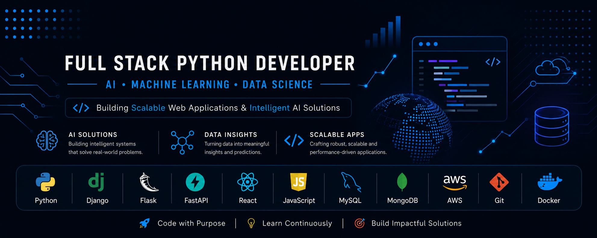

  

# Hi 👋, I'm Mahesh Malbhage

### Full Stack Python Developer | AI & Machine Learning Enthusiast

I am a Full Stack Python Developer with experience building scalable web applications using Django, Flask, React, FastAPI, MySQL, and MongoDB. I enjoy solving real-world problems through software development and exploring AI, Machine Learning, and Data Science to create intelligent solutions.

## 🚀 About Me

- 💼 Software Developer Intern at WhiskerBond
- 🌱 Currently learning Generative AI, FastAPI, Docker & AWS
- 🤖 Interested in AI, Machine Learning and Data Science
- 💻 Passionate about Full Stack Development
- 📫 Reach me at: your-email@example.com

## 🛠️ Tech Stack

### Languages
- Python
- JavaScript
- SQL
- HTML5
- CSS3

### Frontend
- React.js
- Tailwind CSS
- Bootstrap
- Vite

### Backend
- Django
- Flask
- FastAPI

### Database
- MySQL
- MongoDB

### AI & Data Science
- NumPy
- Pandas
- Scikit-learn
- TensorFlow
- OpenCV

### Tools
- Git
- GitHub
- Linux
- AWS
- Docker

## 📌 Featured Projects

### 🏥 AI Skin Cancer Detection
A deep learning application for detecting skin cancer using TensorFlow and OpenCV.

**Tech Stack:** Python, TensorFlow, OpenCV, Flask

---

### 💳 Credit Card Fraud Detection
Machine learning model to identify fraudulent transactions.

**Tech Stack:** Python, Scikit-learn, Pandas

---

### 🐾 WhiskerBond
A full-stack pet service platform with authentication, booking, and responsive UI.

**Tech Stack:** React, Django, MySQL

---

### 📈 Bitcoin Price Prediction
Machine learning model to predict Bitcoin prices using historical market data.

**Tech Stack:** Python, Pandas, Scikit-learn

## 💼 Experience

### Software Developer Intern
**WhiskerBond**

- Developed responsive web interfaces using React.
- Worked on backend features using Django.
- Integrated APIs and optimized database queries.
- Collaborated with team members using Git.

## 📜 Certifications

- AWS Cloud Foundations
- IBM Data Science
- Google Analytics Certification

## 🌐 Connect With Me

- LinkedIn: www.linkedin.com/in/maheshmalbhage
- GitHub: https://github.com/malbhagemahesh
- Email: mr.malbhage@gmail.com
